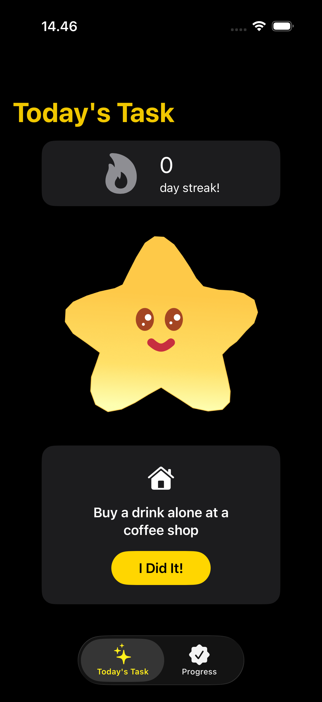
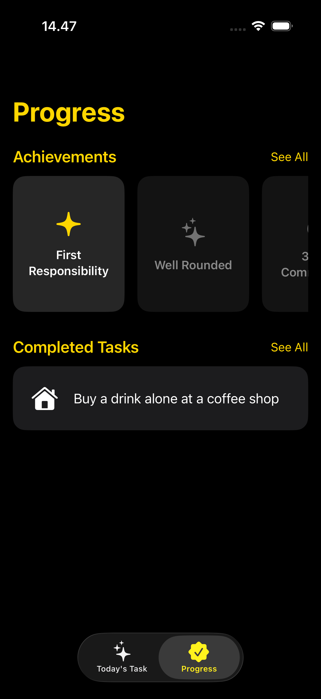
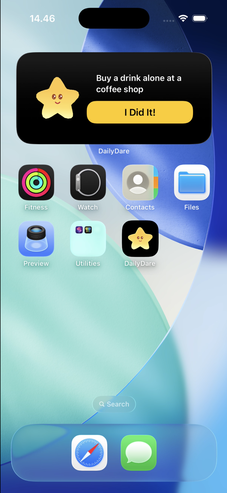
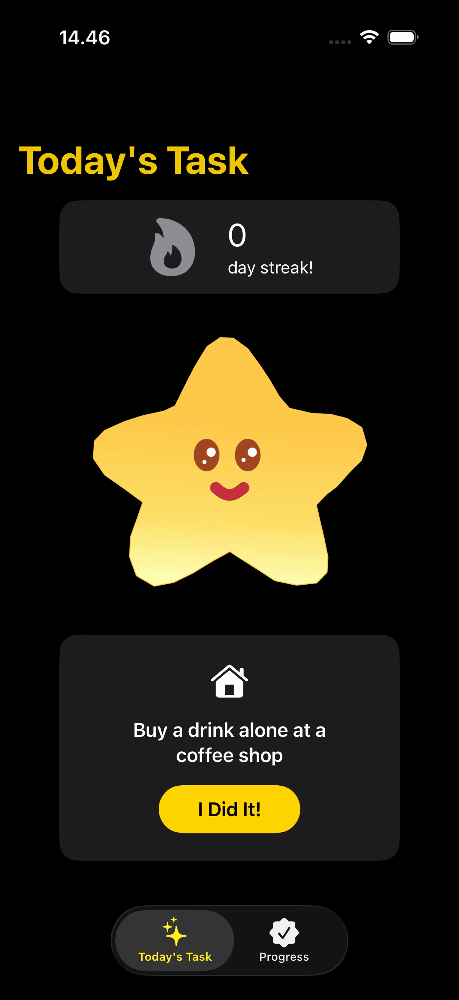

# DailyDare

**Small challenge everyday to build real-life responsibility**

DailyDare is an iOS app built for students and young adults who are living on their own for the first time. It helps people build responsibility and confidence gradually through small, low-stakes daily tasks that gently push them out of their comfort zone

## Screenshots

| Today's Task | Progress | Home Screen Widget |
|---|---|---|
|  |  |  |

### Widget Demo

Marking a task done directly from the Home Screen, no need to open the app:

<p align="center">
  
</p>


## Features

- **Today's Task**  
a new task is assigned every day, drawn randomly from a pool of tasks you haven't completed yet
- **Streak tracking**  
build a streak by completing your task each day; the streak resets if a task is ignored, but freezes (not resets) if the whole task pool is temporarily exhausted
- **10 Achievements**  
unlockable milestones for things like your first completed task, touching every category, hitting streak milestones, and completing an entire category
- **Progress screen**  
browse unlocked and locked achievements (flip cards for details), and look back through everything you've completed
- **Home Screen Widget**  
see today's task at a glance, and mark it done with a single tap, no need to open the app

### Task categories

| Category | Focus |
|---|---|
| Self-Sufficient | Everyday independence (food, money, small errands) |
| Reaching Out | Social confidence (small, low-pressure interactions) |
| Steady Mind | Emotional grounding (reflection, focus, presence) |

## Tech Stack

- **SwiftUI** — UI, iOS 17+
- **SwiftData** — local persistence, shared with the widget via an App Group
- **WidgetKit** — Home Screen widget (Large family)
- **App Intents** — the interactive "I Did It!" button on the widget

- **Local Swift Package (DailyDareKit)** — Models, Services, and App Intents shared between the app and the widget extension

## Project Structure

The project follows a feature-based architecture with a shared local framework:

```
DailyDare/
├── DailyDare/                  # Main iOS app target
│   ├── App/                    # Entry point, SwiftData container, root tab navigation
│   ├── Features/
│   │   ├── TodayTask/          # Today's challenge screen + components
│   │   └── Progress/           # Achievements & completed-task history screens
│   ├── SeedData/                # Default task/achievement JSON + loader
│   └── Debug/                   # Debug/reset utilities, preview containers
├── DailyDareWidget/             # WidgetKit extension (interactive Home Screen widget)
└── DailyDareKit/                # Local Swift Package shared by the app and the widget
    ├── Models/                  # Shared SwiftData entities
    ├── Service/                 # Business logic (task generation, streaks, achievements)
    ├── Intents/                 # App Intents (widget "mark done" button)
    └── App/                     # Shared App Group SwiftData container factory
```

* **`/DailyDare/App`**: Contains the application entry point (`DailyDareApp`), SwiftData container initialization, and the root tab navigation (`RootTabView`).
* **`/DailyDare/Features/TodayTask`**: Contains the main daily challenge interface (`TodayTaskView`) and UI components (`TodayTaskCard`, `StreakCounterCard`, `MessageCard`) for displaying and completing the daily challenge.
* **`/DailyDare/Features/Progress`**: Contains the views (`DailyDareProgressView`, `AllAchievementsView`, `AllCompletedTasksView`) and card components to track milestone badges and review completed task history.
* **`/DailyDare/SeedData`**: Contains the default JSON data files (`seed_tasks.json`, `seed_achievements.json`) and the loader (`SeedDataLoader`) that seeds the initial challenge and achievement pool.
* **`/DailyDare/Debug`**: Contains debugging utilities and in-memory mock containers (`DebugDataResetter`, `ModalContainer+Preview`) used for testing and Xcode Canvas previews.
* **`/DailyDareWidget`**: Contains the WidgetKit implementation (`DailyDareWidget`, `TaskTimelineProvider`, `ActiveTaskWidgetView`, `CompletedTaskWidgetView`) for the interactive Home Screen widget.
* **`/DailyDareKit/Models`**: Defines the shared SwiftData data entities (`DailyTask`, `Achievement`, `UserProgress`) used across both the main app and the widget.
* **`/DailyDareKit/Service`**: Contains the core business logic, including daily task assignment (`TaskGeneratorService`), streak calculation and freeze logic (`StreakService`), and achievement unlocking evaluations (`AchievementService`).
* **`/DailyDareKit/Intents`**: Contains interactive App Intents (`MarkTaskDoneIntent`) enabling users to mark tasks as completed directly from the Home Screen widget button.
* **`/DailyDareKit/App`**: Contains `ModelContainerFactory`, configuring the shared App Group SQLite store so both the main app and widget extension stay synchronized.

## Getting Started

### Requirements

- Xcode 15 or later
- iOS 17.0+ (Simulator or device)

### Setup

1. Clone the repo and open `DailyDare.xcodeproj` in Xcode.
2. In **Signing & Capabilities**, set your own Team for both the `DailyDare` and `DailyDareWidgetExtension` targets.
3. Make sure **App Groups** is enabled on both targets, using the same group identifier. Update the identifier in `ModelContainerFactory.swift` (inside `DailyDareKit`) to match.
4. Build and run the `DailyDare` scheme.
5. To try the widget, add it to your Home Screen from the widget gallery (long-press Home Screen → **+** → search "DailyDare").

## Design Decisions

This project intentionally avoids a Configuration App Intent for the widget (there's nothing for the user to customize) and Live Activities / Control Widgets (out of scope for this MVP). Business logic (task generation, streak rules, achievement unlocking) lives entirely in `DailyDareKit` so it can be called identically from the app and from the widget's interactive button, keeping both in sync against the same App Group.

## Disclaimer & Usage Terms

This project is created strictly for **educational and portfolio purposes**. 

* **Educational Use Only:** You are welcome to clone, inspect, and use this codebase for personal learning, code review, or study.
* **Non-Commercial:** This project, its source code, design assets, and task content **cannot** be used for any commercial purposes or monetized in any form.
* **No Re-distribution or App Store Publishing:** You are **strictly prohibited** from publishing, re-uploading, or distributing this app (or any modified version of it) to the Apple App Store, TestFlight, or any public app distribution platform.
* **Attribution:** If you reference or use parts of this code for your own educational projects, please provide clear attribution back to this repository and author.
* **As-Is Basis:** This project is provided "as is" without warranty of any kind.
